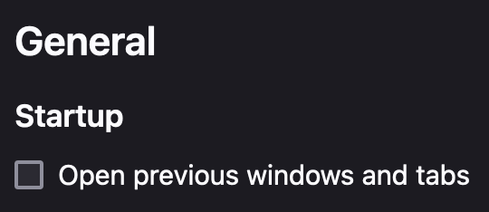
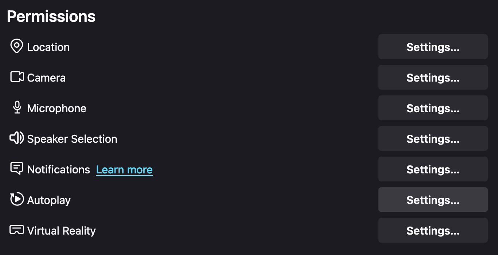
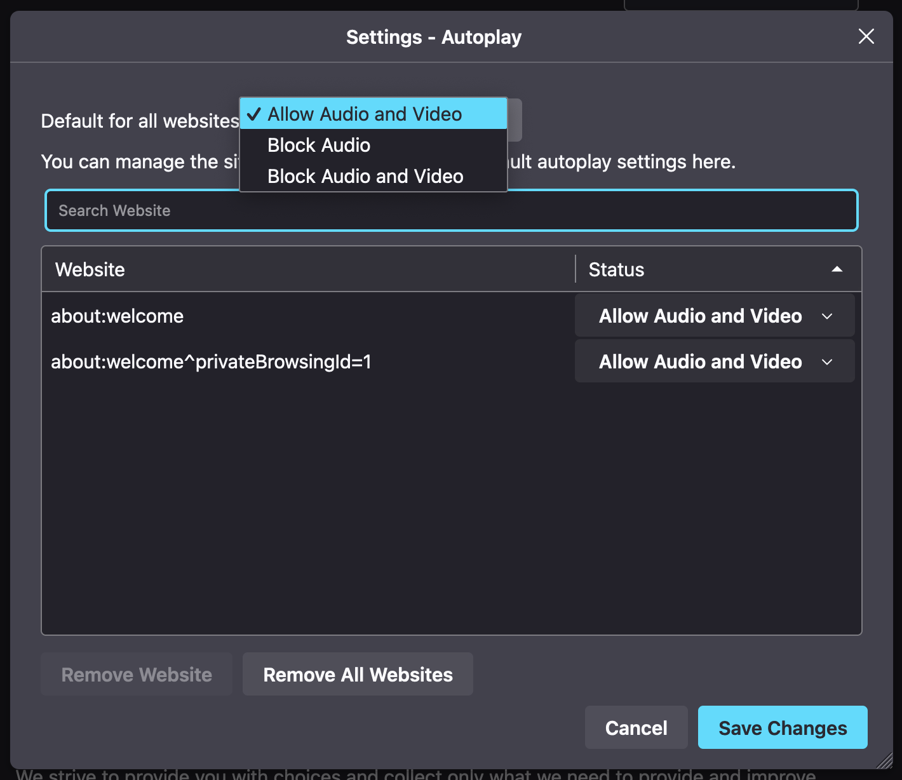

# Browser setup

*This page assumes that you are using a firefox-based browser. If you are not, then your browser's respective settings should be changed instead.*

After installing mercury, there are a few settings that you need to adjust before setting up the scripts. 

First and foremost is to disable "Open previous windows and tabs". This should be at the top of the preferences menu. 

The second setting that you have to change can be found in the "Privacy & Security" tab. Navigate to the "Permissions" section and select "Autoplay". 

This should open up a popup, where you have to change "Block Audio" to "Allow Audio and Video".

Finally, press "Save Changes". Everything should be ready to go. You can now move on to [setting up the scripts](/SCRIPTS.md).

## Discussion

* Why disable "Open previous windows and tabs"?
  * Opening previous tabs results in tabs getting reopened, which can be harmful to performance and somewhat difficult to detect (since you cant see tabs in kiosk mode).

* Why enable Audio/Video autoplay on *all* sites?
  * Mostly because it's easy and since it has very few downsides. The cabinet doesn't have a mouse or keyboard, making it difficult for students to abuse it. 
