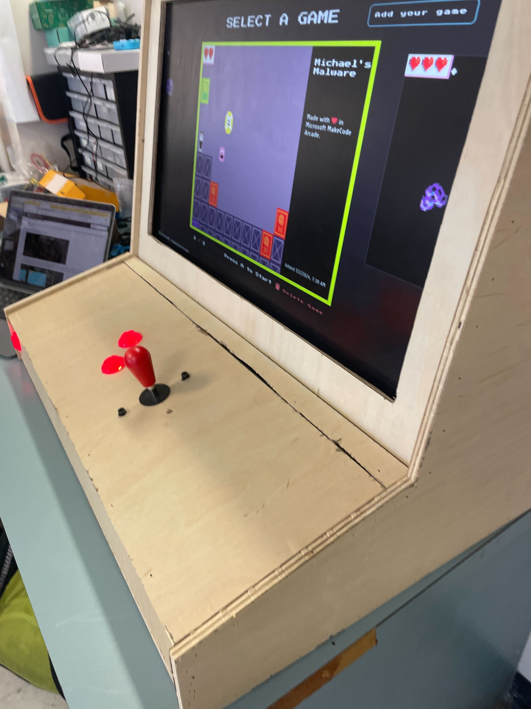

# MakeCode Documentation

### This repo is just documentation for an arcade machine that [Milo](https://github.com/melonkgur), [Justin](https://github.com/Jbay33), [and I](https://github.com/mpot05) helped make in highschool (2023/2024).

## Get started

To start, you should check out the [guide](/GUIDE.md).

If you're just here to learn about this project, feel free to stick around. 

## About the project

Upon the discovery of Microsoft's MakeCode Arcade, our teacher had the idea to make an actual arcade cabinet to play student-made games on. At first, we weren't sure if it was even possible, but we persevered—and ended up making something pretty cool.

The cabinet is powered by a Rasberry Pi with a custom joystick/gamepad board. After a breif detour to ubuntu, we settled on running Raspbian (aka Raspberry Pi OS). We also switched browsers several times: first to a custom webview, then to Firefox, and finally to Mercury (a heavily optimized version of Firefox), running a MakeCode kiosk page. 

The setup that we landed on has the least amount of lag out of any of the other things that we have tried.

## General links

useful links:

* [MakeCode Arcade](https://arcade.makecode.com)

* [MakeCode Arcade Kiosk Page](https://arcade.makecode.com/kiosk)

* [General Kiosk Setup Page](https://arcade.makecode.com/hardware/kiosk)

MakeCode's Kiosk version has a few options. These options are added at the end of the URL. 
These options are: 

* `/kiosk?clean=1`, which will get rid of the default games microsoft puts in the kiosk by default. 
* `/kiosk?lock=1`, which will not let people add or delete games to the kiosk.

*You can also combine them if you want, with `/kiosk?lock=1&clean=1`.*

Kids can make their own games on MakeCode's main website to then upload to the kiosk. 
*To upload games to the machine, follow the setup page linked above.*

That concludes general setup with an already setup machine and games.

## Things we tried (that didn't work)

### Operating system

We started with Ubuntu since we wanted to be able to have a full set of features built in—however, as we got further into the project, we eventually realized that Ubuntu was just too laggy and unstable, so we switched to arch. 

That didn't last very long though, (seeing as we couldn't even set up X11) so we quickly switched all the way back to Raspbian (Raspberry Pi OS).

### Webview browser

Initially, we had assumed that it would be best to run the makecode window in its own custom app/webview. This was to allow for greater control over the app as well as (what we assumed would be) better performance. 

In our first attempt, we used C, [GTK](https://www.gtk.org/), and [WebkitGTK](https://webkitgtk.org/). Unfortunately, we ran into many compiler issues when trying to compile with both of these libraries, not to mention some version mismatch issues. Even after getting through these, we were still relatively sure that we would've had to manually bind joystick inputs to mouse/keyboard ones, so we decided to try something else:

In our second attempt, we used Rust as well as the [Tao](https://github.com/tauri-apps/tao) and [Wry](https://github.com/tauri-apps/wry), both from the [Tauri](https://github.com/tauri-apps/tauri) package. We hardly had to change the default example code to get it to run, however, we quickly ran into issues with both compilation and runtime performance. Throughout the process of compilation, you could expect the compiler (or pi) to crash anywhere from 1 to 5 times. Once it was done, the generated binary was so inneficient (even with "build" settings and the maximum amount of optimization that we could set it to) that it couldn't even render a page (unless you opened the binary file without using `cargo run`, in which case it would just be abysmally slow and laggy). 

Ultimately, we gave up on the custom browser and decided that it would be best to just use firefox, and later mercury (since its just heavily optimized firefox). To supplement the experience, we also made a few scripts, which can be found [here](https://github.com/mpot05/makecode-docs/tree/main/snippets). 
